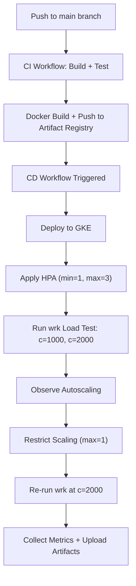

# 🌸 Iris MLOps Project — CI/CD with GKE Auto-Scaling & Stress Testing

## 📘 Overview

This project demonstrates a **complete MLOps pipeline for the IRIS classification model**, covering **Continuous Integration (CI)**, **Continuous Deployment (CD)**, and **Scaling under Load** using:

* **GitHub Actions**
* **Docker**
* **Google Cloud (Artifact Registry + GKE)**
* **Kubernetes Horizontal Pod Autoscaler (HPA)**

The pipeline automates the **build → deploy → test → scale** lifecycle of a machine learning model to ensure **reliable, reproducible, and scalable** deployments in production.

---

## 🎯 Objectives

| #   | Objective                | Description                                                                       |
| --- | ------------------------ | --------------------------------------------------------------------------------- |
| 1️⃣ | Extend CI/CD pipeline    | Automate deployment of Iris model from GitHub to GKE                              |
| 2️⃣ | Stress test deployment   | Use `wrk` to simulate high concurrent traffic (>1000 requests)                    |
| 3️⃣ | Demonstrate auto-scaling | Configure Kubernetes HPA (`min=1`, `max=3`) to handle load dynamically            |
| 4️⃣ | Observe bottlenecks      | Restrict scaling to 1 pod and re-run load test to observe performance degradation |

---

## ⚙️ Pipeline Overview

### 🧱 Continuous Integration (CI)

The **CI workflow** ensures the model and codebase are valid before deployment:

* Lints and validates the source code
* Runs unit tests on the Iris classifier
* Verifies DVC model integrity (`dvc pull`)
* Builds a Docker image for the Iris API
* Stores the container in **Google Artifact Registry**

**Key benefits:**

* Ensures **model reproducibility**
* Detects **integration errors early**
* Keeps build process **consistent** across environments

---

### 🚀 Continuous Deployment (CD)

The **CD workflow (`cd.yml`)** automates model deployment and scaling on **Google Kubernetes Engine (GKE)**.

**CD Workflow Stages:**

1. **Checkout & Setup**

   * Fetch repository
   * Configure `gcloud` and `kubectl`
   * Authenticate with GCP using a service account
2. **Build & Push**

   * Pull model files using DVC
   * Build a Docker image for the Iris API
   * Push the image to Artifact Registry
3. **Deploy to GKE**

   * Apply `deployment.yaml` and `service.yaml`
   * Wait for LoadBalancer external IP
4. **Enable Autoscaling**

   * Apply HPA (`minReplicas=1`, `maxReplicas=3`)
5. **Load Testing**

   * Deploy an in-cluster `wrk-tester` pod
   * Execute concurrent load tests (1000 & 2000 requests)
   * Record latency, throughput, and scaling events
6. **Bottleneck Observation**

   * Restrict HPA (`maxReplicas=1`)
   * Re-run load tests to observe stress behavior
7. **Artifact Upload**

   * Save results (`wrk-*.txt`) to GitHub artifacts

---

## 🧩 Project Structure

```
iris-mlops/
│
├── src/
│   ├── app.py           # Flask/FastAPI serving the Iris model
│   ├── model/           # DVC-managed model files
│   └── requirements.txt
│
├── k8s/
│   ├── deployment.yaml   # Kubernetes deployment file
│   ├── service.yaml      # LoadBalancer service for API
│   └── hpa.yaml          # Horizontal Pod Autoscaler definition
│
├── .github/
│   └── workflows/
│       ├── ci.yml       # Continuous Integration workflow
│       └── cd.yml       # Continuous Deployment workflow
│
├── scripts/
│   ├── wrk_post.lua     # POST request payload for wrk
│   └── run_wrk.sh       # Helper script for running wrk locally
│
├── dvc.yaml / .dvc/     # DVC configuration for versioned model storage
├── Dockerfile           # Container definition for model inference API
└── README.md            # Project documentation
```

---

## 🚀 Setup Instructions

### 🔧 Prerequisites

* Google Cloud project with:

  * **GKE Cluster**
  * **Artifact Registry**
  * **Service Account** with permissions for:

    * Artifact Registry
    * GKE Admin
    * Cloud Storage
* GitHub repository secrets:

  * `GCP_PROJECT`
  * `GCP_REGION`
  * `ARTIFACT_REGISTRY_REPOSITORY`
  * `GKE_CLUSTER_NAME`
  * `GKE_CLUSTER_ZONE`
  * `GCP_DEPLOY_SA_KEY`

---

### 🧰 Local Setup

```bash
# Clone repository
git clone https://github.com/<your-username>/iris-mlops.git
cd iris-mlops

# Build and run locally
docker build -t iris-api .
docker run -p 8080:8080 iris-api
```

---

### ☸️ Deploy Manually (optional)

```bash
kubectl apply -f k8s/deployment.yaml
kubectl apply -f k8s/service.yaml
kubectl apply -f k8s/hpa.yaml
```

---

## 🔄 CI/CD Workflow Flowchart



---

## 📈 Horizontal Pod Autoscaler Example

```yaml
apiVersion: autoscaling/v2
kind: HorizontalPodAutoscaler
metadata:
  name: iris-api-hpa
spec:
  scaleTargetRef:
    apiVersion: apps/v1
    kind: Deployment
    name: iris-api
  minReplicas: 1
  maxReplicas: 3
  metrics:
    - type: Resource
      resource:
        name: cpu
        target:
          type: Utilization
          averageUtilization: 50
```

---

## 🧪 Load Testing (`wrk`)

**wrk script (`wrk_post.lua`):**

```lua
wrk.method = "POST"
wrk.headers["Content-Type"] = "application/json"
wrk.body = '{"instances":[[5.1,3.5,1.4,0.2]]}'
```

**Commands executed automatically by CD:**

```bash
wrk -t4 -c1000 -d30s -s wrk_post.lua http://iris-api-lb/predict
wrk -t4 -c2000 -d30s -s wrk_post.lua http://iris-api-lb/predict
```

**Expected Results:**

| Scenario                 | Pods Expected | Outcome                                            |
| ------------------------ | ------------- | -------------------------------------------------- |
| Load = 1000              | 2–3 pods      | Normal scaling, stable latency                     |
| Load = 2000 (scalable)   | 3 pods        | Increased CPU, manageable latency                  |
| Load = 2000 (max_pods=1) | 1 pod         | Request timeout, high latency, observed bottleneck |

**Artifacts uploaded after every CD run:**

* `wrk-1000.txt` – wrk results at 1000 concurrency
* `wrk-2000.txt` – wrk results at 2000 concurrency
* `wrk-pods.txt` – pod metrics and scaling info

---

## 🧹 Cleanup

```bash
kubectl delete deployment iris-api
kubectl delete svc iris-api-lb
kubectl delete hpa iris-api-hpa
```

---

## 💡 Key Learnings

* Complete CI/CD pipeline with GitHub Actions and GCP
* Seamless model integration using DVC
* Efficient container orchestration with GKE
* Automatic scaling based on CPU metrics
* Real-world stress testing using in-cluster tools (`wrk`)

---

## 🏁 Conclusion

This project serves as a reference MLOps implementation demonstrating how to:

* Build and deploy ML models automatically
* Scale efficiently under real-world load
* Monitor and analyze performance bottlenecks

**Maintainer:** Karan Shrivastava
**Version:** 1.0.0
**Contact:** [karanshrivastava00@gmail.com](mailto:karanshrivastava00@gmail.com)
